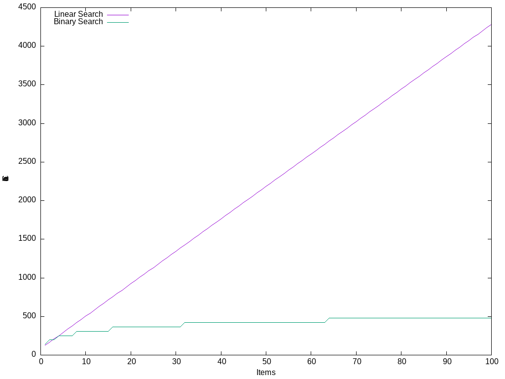

    

# al-Khwarizmi

The project's name is a tribute to [Muḥammad ibn Mūsā al-Khwārizmī](https://en.wikipedia.org/wiki/Muhammad_ibn_Musa_al-Khwarizmi), whose name gave rise to the word algorithm.
Is the code worthy of a tribute? I will let you judge.

This project is an implementation, in C, of the most basic algorithms.

# Costs

    

# Credits

By Unknown Author - http://www.muslimheritage.com/topics/default.cfm?ArticleID=631, [1], Public Domain, https://commons.wikimedia.org/w/index.php?curid=2652443
